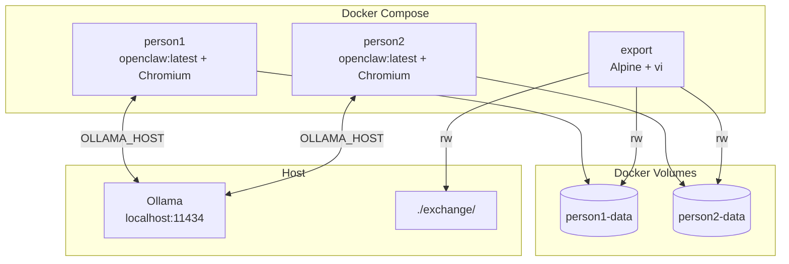
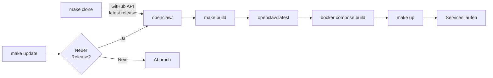

# OpenClaw Docker-Setup

Einfaches Docker-Setup für [OpenClaw](https://github.com/openclaw/openclaw) mit beispielhafter individueller Image-Erweiterung und Anbindung an einen lokalen Ollama-Service.

## Architektur



## Setup- & Update-Fluss



## Voraussetzungen

- [Docker](https://docker.com) & Docker Compose
- [Ollama](https://ollama.com) läuft auf dem Host (Port `11434`)
- `git`, `curl`, `make`

## Schnellstart

```bash
# Alles auf einmal: Repo clonen, Images bauen, Services starten
make setup
make up

# Einmaliges Onboarding pro Instanz
docker compose exec person1 openclaw onboard
docker compose exec person2 openclaw onboard
```

## Make-Targets

| Target | Beschreibung |
|--------|--------------|
| `make clone` | Klont das neueste OpenClaw-Release (shallow) |
| `make build` | Baut `openclaw:latest` und das Compose-Projekt |
| `make up` | Startet alle Services im Hintergrund |
| `make down` | Stoppt alle Services |
| `make setup` | Alias für `clone` + `build` |
| `make update` | Prüft auf neues Release, baut bei Bedarf neu |

## Wichtige Hinweise

### Ollama auf dem Host

Die Services verbinden sich über `host.docker.internal:11434` mit Ollama. Auf **Linux** musst du ggf. die `extra_hosts`-Zeilen in der `docker-compose.yml` einkommentieren:

```yaml
extra_hosts:
  - "host.docker.internal:host-gateway"
```

Auf macOS/Windows (Docker Desktop) funktioniert es out-of-the-box.

### Datenexport

Der `export`-Service startet nicht automatisch. Nutze ihn für manuelle Datei-Operationen:

```bash
docker compose --profile export run export
```

Innerhalb der Shell stehen dir zur Verfügung:
- `/data/person1` – Daten von person1
- `/data/person2` – Daten von person2
- `/host-exchange` – Austauschordner auf dem Host (`./exchange/`)

### OpenClaw CLI verwenden

Die `openclaw`-Binary liegt im Container im `PATH`. Du führst Befehle über `docker compose exec` aus:

```bash
# Konfiguration aufrufen
docker compose exec person1 openclaw configure

# Hilfe anzeigen
docker compose exec person1 openclaw --help

# Direkt in die Shell eines Containers wechseln
docker compose exec person1 sh
```

### Chromium statt Google Chrome

Das Image installiert **Chromium** (anstelle von Google Chrome), da Chrome kein offizielles Linux-ARM64-Build bietet. Für die meisten Anwendungsfälle (Headless-Browser, Puppeteer, Playwright) ist das identisch.
